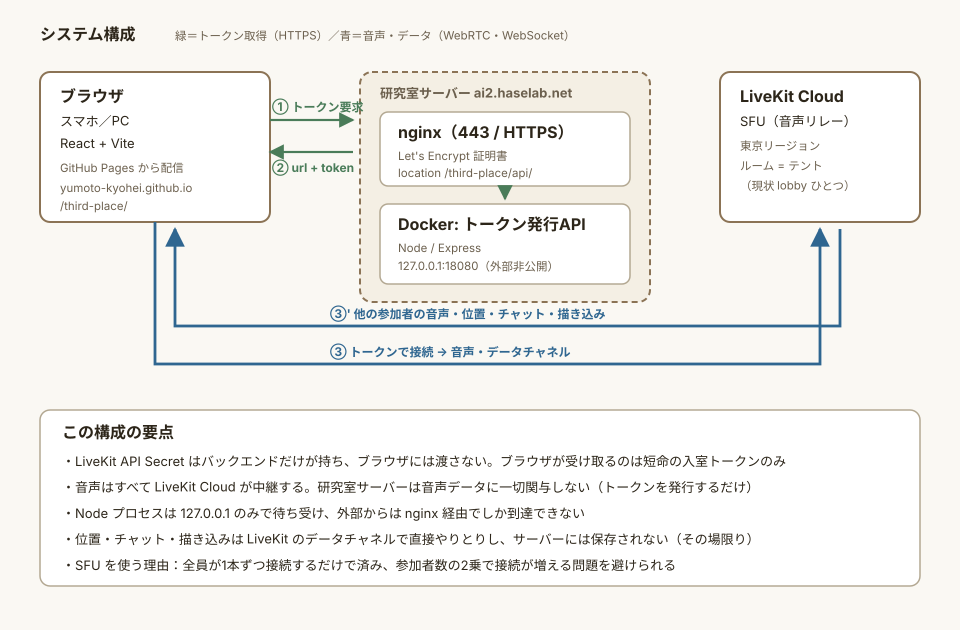
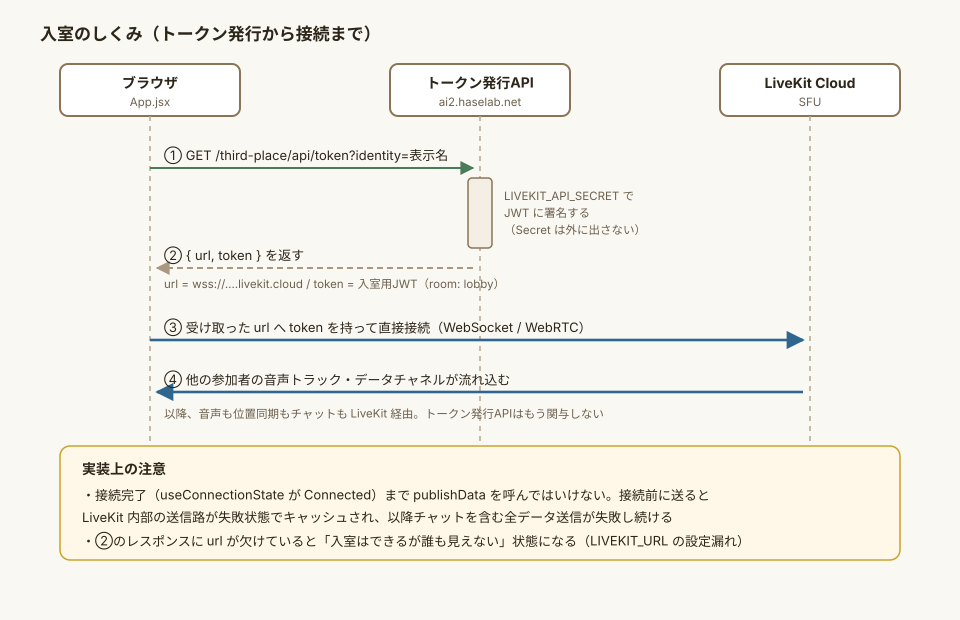
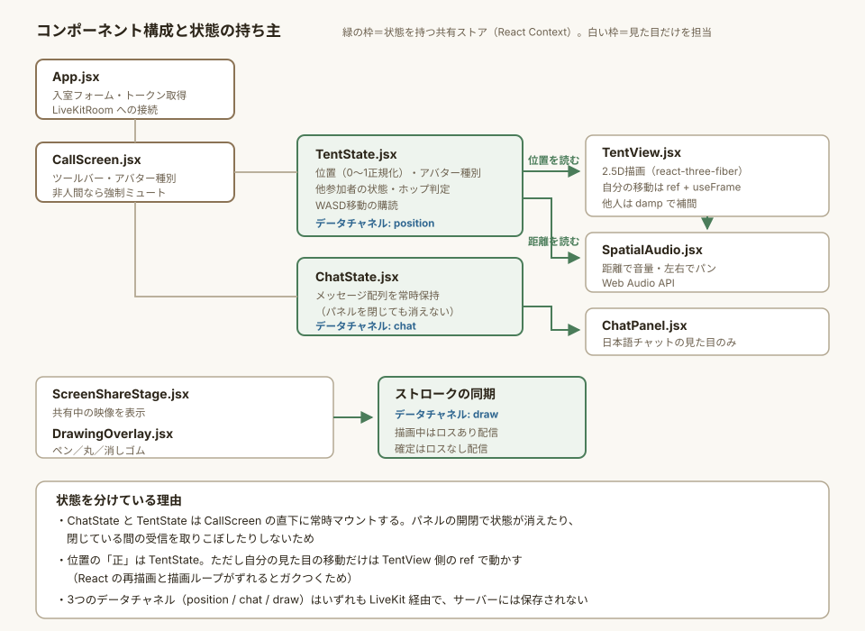
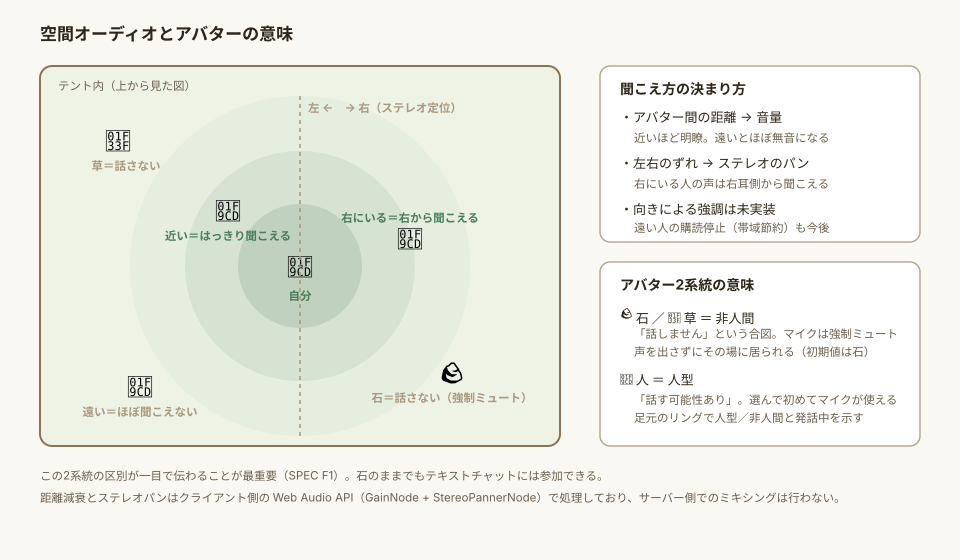

# third-place 技術仕様書

『通りとテント』アプリのプロトタイプ **third-place** の技術的な構成・実装方針をまとめた文書。

- **何を作るか・なぜ作るか**は [SPEC.md](SPEC.md)（全体仕様書）を参照
- **動かし方・運用手順**は [README.md](README.md) を参照
- 本書は「**どう作られているか**」と「**なぜその作りにしたか**」を扱う

対象読者：研究室メンバー、および今後この実装に手を入れる人（AIエージェントを含む）。

---

## 1. 全体構成



### 1.1 3つの構成要素

| 要素 | 実体 | 役割 |
|---|---|---|
| フロントエンド | React 19 + Vite。GitHub Pages で配信 | UI・2.5D描画・空間オーディオの計算 |
| バックエンド | Node/Express。`ai2.haselab.net` 上の Docker | **入室トークンの発行だけ**を行う |
| SFU | LiveKit Cloud（東京リージョン） | 音声とデータチャネルの中継 |

### 1.2 なぜ SFU を使うか

WebRTC は本来1対1通話を前提とした技術で、参加者全員が互いに直接つなぐ（メッシュ）と接続数が
参加者数の2乗で増える。SFU（Selective Forwarding Unit）は各参加者がサーバーに1本だけ接続し、
サーバーが他の参加者へ配信し直す方式で、これを解消する。

自前でメディアサーバーを運用する負担を避けるため、現状は LiveKit 社のマネージド
ホスティング（LiveKit Cloud）を利用している。LiveKit は OSS でセルフホスト可能なので、
将来研究室サーバーへ移す選択肢は残っている（SPEC §7.4）。

### 1.3 バックエンドが「トークン発行だけ」である理由

音声・位置・チャット・描き込みは**すべて LiveKit を経由**し、バックエンドを通らない。
バックエンドの責務は、LiveKit API Secret で署名した入室トークンを発行することだけ。

この分離により：

- **API Secret がブラウザに渡らない**。ブラウザが持つのは短命の入室トークンのみ
- バックエンドが落ちても、**既に入室している人の通話は切れない**（新規入室だけができなくなる）
- バックエンドは状態を持たないので、スケールや再起動を気にしなくてよい

裏返すと、**現状サーバー側にはログが一切残らない**。ログ収集（SPEC F10）を始めるには
「クライアント → バックエンドへイベント送信」という経路を新設する必要がある。

---

## 2. 入室のシーケンス



```
GET https://ai2.haselab.net/third-place/api/token?identity=<表示名>
  → { "url": "wss://….livekit.cloud", "token": "eyJ…" }
```

発行されるトークンの権限（grant）は `roomJoin: true, canPublish: true, canSubscribe: true`、
ルームは `lobby` 固定。

### 2.1 エンドポイント一覧

| メソッド・パス | 用途 |
|---|---|
| `GET /api/token?identity=<表示名>` | 入室トークンの発行。`identity` 未指定は 400 |
| `GET /api/healthz` | 死活監視。`{ ok: true }` を返すだけ |

> `healthz` を `/api` の**内側**に置いているのは、nginx が `/third-place/api/` だけを
> リバースプロキシしているため。`/healthz` に置くと外部から到達できない。

### 2.2 認証について

**現状、トークン発行APIには認証もレート制限もない。** URLを知っていれば誰でもトークンを取得し
`lobby` に入室できる。CORS で許可オリジンは限定しているが、CORS はブラウザ側の制約であって
`curl` 等には効かないため、アクセス制御の手段にはならない。

α版（研究室内クローズドテスト）では許容しているが、キャンパス実証の前に対処が必要
（SPEC §7.5 / F11）。

---

## 3. フロントエンドの構成



### 3.1 状態の持ち主を分けている理由

状態を持つのは `TentState` と `ChatState` の2つの React Context だけで、他は見た目を担当する。

**両方とも `CallScreen` の直下に常時マウントしている。** チャットパネルの開閉に連動して
マウント／アンマウントすると、閉じたときに履歴が消え、閉じている間のメッセージも
取りこぼす。表示の切り替えは `ChatPanel` の描画有無だけで行い、状態はその外側に置く。

| モジュール | 担当 |
|---|---|
| `App.jsx` | 入室フォーム、トークン取得、`LiveKitRoom` への接続 |
| `CallScreen.jsx` | ツールバー、アバター種別の保持、非人間アバター時の強制ミュート |
| `TentState.jsx` | 位置・アバター種別の**正**。データチャネル `position` で同期 |
| `ChatState.jsx` | チャット履歴。データチャネル `chat` で同期 |
| `TentView.jsx` | 2.5D描画（react-three-fiber）と自分の移動 |
| `SpatialAudio.jsx` | 距離減衰・ステレオパン（Web Audio API） |
| `AvatarSprite.jsx` | アバターの見た目と種別判定。**差し替え前提で分離** |
| `ChatPanel.jsx` | チャットの見た目のみ |
| `ScreenShareStage.jsx` / `DrawingOverlay.jsx` | 画面共有の表示と描き込み |

### 3.2 座標系

`TentState` が持つ位置は **床のサイズに依存しない 0〜1 の正規化座標** `{x, y}`。
3Dワールド座標への変換は `TentView` 側で行う（`FIELD = 24` ワールド単位）。

```
worldX = (x - 0.5) * FIELD
worldZ = (y - 0.5) * FIELD
```

空間オーディオの距離計算は正規化座標のまま行うため、床の大きさを変えても
聞こえ方の設計値（§5）を調整し直す必要はない。

---

## 4. データチャネル

位置・チャット・描き込みは、いずれも LiveKit のデータチャネル（`useDataChannel`）で
やりとりする。**サーバーには保存されず、その場限り**。

| チャネル | 内容 | 配信方式 |
|---|---|---|
| `position` | 位置（正規化座標）＋アバター種別 | 移動中はロスあり、確定時とハートビートはロスなし |
| `chat` | テキストメッセージ | ロスなし |
| `draw` | 描き込みのストローク | 描画中の点はロスあり、開始・終了・確定はロスなし |

### 4.1 位置同期の設計

`TentState.jsx` の実際の値：

| 定数 | 値 | 意味 |
|---|---|---|
| `SEND_INTERVAL_MS` | 100 | 位置更新の送信間隔（約10Hz） |
| `HEARTBEAT_MS` | 2000 | 状態の定期再送 |
| `HOP_LINGER_MS` | 350 | ホップ演出を続ける時間 |
| `MOVE_EPSILON` | 0.001 | これ未満の差は「動いていない」とみなす |

**ハートビートを送る理由**：データチャネルは「その時つながっている人」にしか届かない。
後から入室した人に既存メンバーの位置とアバター種別を伝えるため、2秒ごとに現在の状態を
再送している。

**`MOVE_EPSILON` が必要な理由**：ハートビートは同じ座標を再送するので、単純に「位置の
メッセージが来たらホップさせる」とすると、誰も動いていないのに全員が2秒ごとに跳ねてしまう。
前回との差分を見て、実際に動いたときだけホップさせている。

### 4.2 ⚠️ 接続完了前に `publishData` を呼んではいけない

**この実装で最も壊しやすい箇所。**

`useConnectionState()` が `Connected` になる前に `publishData` を呼ぶと、LiveKit 内部の
送信路（`publisherConnectionPromise`）が**失敗状態でキャッシュされ、以降チャットを含む
すべてのデータ送信が失敗し続ける**。しかもエラーは分かりにくい形でしか出ない。

`TentState.jsx` の `publish` にはこのガードが入っている。**新しくデータチャネルを追加する
ときは、必ず同じガードを設けること。**

### 4.3 `publishData` は自分には配信されない

送信者自身にはエコーバックされない。そのため自分の操作結果は**ローカルに即時反映してから
送る**必要がある（チャットの自分の発言、描き込みのストロークとも、この方式）。

---

## 5. 空間オーディオ



LiveKit 標準の `RoomAudioRenderer` は使わず、各参加者の音声トラックを Web Audio API の
`GainNode` → `StereoPannerNode` に通して再生している。

`SpatialAudio.jsx` の設計値（いずれも正規化座標での距離）：

| 定数 | 値 | 意味 |
|---|---|---|
| `NEAR` | 0.12 | これより近ければ最大音量 |
| `FAR` | 0.6 | これより遠ければほぼ無音 |
| `PAN_RANGE` | 0.4 | 左右にこれだけ離れるとフルパン |

サーバー側でのミキシングは行わない。各クライアントが自分から見た距離・方向で計算するため、
参加者が増えてもサーバー負荷は増えない。

**Chrome 向けのワークアラウンド**：Web Audio 経由で再生するだけでは音が出ないことがあるため、
無音の `<audio>` 要素にも同じストリームを割り当てている（定番の回避策）。

**未実装**：向きによる強調（正面の人がよく聞こえる）、遠方トラックの購読停止による帯域節約。
どちらも SPEC F2 に記載があり、参加者が増えたときに必要になる。

---

## 6. 2.5D 描画

床だけ 3D で、アバターはカメラに正対する 2D ビルボード（`@react-three/drei` の `Billboard`）。
高ポリゴンの 3D を避け、スマホでも動く軽さを優先している。

### 6.1 自分の移動は React の state を経由しない

**位置の実体は `worldRef`（`THREE.Vector3`）で、`useFrame` の中で毎フレーム直接動かす。**

React の state を更新して位置を反映すると、React の再描画タイミングと Three.js の描画ループが
ずれてガクガクして見える。これは実際に発生し、`c04fb0e` で ref + `useFrame` 方式に変更して
解消した。

同期はこれとは独立に間引いて行う：`LocalMover` が毎フレーム `worldRef` を動かしつつ、
約100ms間隔（`SYNC_INTERVAL_MS`）で `TentState.updateMyPos` を呼ぶ。
**「自分の描画は60fpsで滑らか、ネットワーク送信は10Hzで十分」**を両立させている。

### 6.2 移動は「目標地点へ定速で歩く」

床をタップ／ドラッグすると `targetRef` に目標地点がセットされるだけで、実際の移動は
`LocalMover` が毎フレーム `MOVE_SPEED`（4ワールド単位/秒）で近づけていく。

**タップ地点へのテレポートはしない。** 当初は即座にワープする実装だったが、遠くをタップすると
画面が一気に動いて酔いやすいという指摘を受けて定速移動に変更した（`42225fc`）。
WASD 入力があれば `targetRef` はキャンセルされ、キー入力が優先される。

他の参加者の位置はネットワーク経由で10Hz程度でしか更新されないため、
`THREE.MathUtils.damp` でなめらかに補間している。

### 6.3 アバターの見た目

素の絵文字テクスチャ（Canvas 2D API で描画）を使い、**絵文字自体には枠を付けない**。

人型／非人間の区別（SPEC F1）と発話中の表示は、絵文字ではなく**足元の「立ち位置マーカー」**で
表現する（接地影＋金の実線リング＝人型／グレーの破線リング＝非人間、発話中は緑のグローリング）。

当初は絵文字に円形フレームを焼き込んでいたが、検証用モックアップ（素の絵文字のみ）と
見比べて「アイコンに枠がついて異物感がある」となり、区別のシグナルを足元へ移した（`42225fc`）。

### 6.4 検証用モックアップ

`client/src/mockup/` と `mockup.html` は、2.5D化の前に「メタバース感が出るか」を本番に影響を
与えず試すために作った別エントリのページ。検証結果が良好だったため本番に採用した。
今後の見た目実験用に残してある（LiveKit・音声・同期は含まない）。

Three.js 関連コードは本番と共有チャンク（`Billboard-*.js` 等）にまとまるため、
二重にバンドルされることはない。

> **Vite開発サーバーでの注意**：以前 `mockup.html` に直接アクセスすると r3f 由来の
> `Invalid hook call`（Reactの重複インスタンス）が出ていた。`vite.config.js` の
> `optimizeDeps.entries: ['index.html', 'mockup.html']` で両エントリを初回に一括スキャン
> させることで解消済み（`5df20f8`）。`resolve.dedupe` だけでは直らなかった。

---

## 7. 画面共有と描き込み

`ScreenShareStage.jsx` が共有中の映像トラックを表示し、その上に `DrawingOverlay.jsx` の
`<canvas>` を重ねる。

- ツールはペン（フリーハンド）／丸で囲む（楕円）／消しゴムの3つ。**明示的に選ぶまで無効**
  （初期状態は `tool = null` で `pointerEvents: 'none'`）。同じツールを再度押すと解除
- 座標はキャンバスサイズに依存しないよう 0〜1 に正規化して送受信
- 消しゴムは**ストローク単位**（線や丸に触れるとその1本ごと削除）。部分消しではない
- 色・太さは固定（ペン=赤 `#ff3b30`、丸=橙 `#ff9500`）

**画面共有は同時に1人のみ想定。** 複数人が同時に共有した場合の表示制御は未実装で、
`ScreenShareStage` は最初の1トラックしか表示しない。

---

## 8. デプロイ構成

| 対象 | 方法 |
|---|---|
| フロントエンド | `main` への push で GitHub Actions が `client/` をビルドし GitHub Pages へ公開（`client/**` の変更時のみ発火） |
| バックエンド | `ai2.haselab.net` 上の `~/third-place` で `git pull && docker compose up -d --build`（**手動**） |

### 8.1 接続先の切り替え

フロントエンドが叩くトークンAPIのURLは、ビルド時に `VITE_TOKEN_SERVER_URL` として埋め込まれる
（本番値は `client/.env.production`）。

**末尾の `/api` まで含んだベースURL**として扱い、`fetch` 側は `/token` だけを足す。
こうしないとパスが `/api/api/token` に二重化する。

接続先を変えるにはこのファイルを変更して再デプロイする必要がある（実行時には変えられない）。

### 8.2 公開経路

Node プロセスは `127.0.0.1:18080` のみで待ち受け、外部に直接公開しない。
`ai2` の nginx（443/HTTPS）に `location /third-place/api/` を追加して
リバースプロキシしている。`restart: unless-stopped` によりサーバー再起動時も自動復帰する。

具体的なコマンドとトラブルシューティングは [README.md](README.md) を参照。

---

## 9. 実装時に守ること

新しく手を入れる人（AIエージェント含む）向けの要点。

1. **接続完了まで `publishData` を呼ばない**（§4.2）。破ると全データ送信が壊れる
2. **`publishData` は自分に返ってこない**。ローカルへ即時反映してから送る（§4.3）
3. **位置の正は `TentState`**。ただし自分の見た目の移動だけは `TentView` の ref で動かす（§6.1）
4. **テキスト入力欄にフォーカスがある間は WASD 移動を無効化する**（`document.activeElement` で判定）。
   チャット入力中にアバターが動いてしまわないように
5. **秘密情報を `~/sandhome/` 配下に置かない**。sandbox コンテナにマウントされており、
   コンテナ内のAIエージェントが同一uidで動くため `chmod 600` では守れない
6. **動作確認は実ブラウザ2つで行う**。ヘッドレスでは実 WebRTC が張れないため、
   `npm run build && npx vite preview` か本番URLで、別ブラウザ／シークレットウィンドウを使う
7. アバターの見た目を変えるときは `AvatarSprite.jsx`（2D）と `TentView.jsx` 内の
   3D用実装の**両方**を見る。仮素材（絵文字）の差し替えを前提に分離してある

---

## 10. 既知の制約

| 項目 | 現状 |
|---|---|
| ルーム | `lobby` 1つのみ固定。複数テント・通り画面は未実装（SPEC Phase 2） |
| 認証 | なし。表示名の自己申告のみ。トークンAPIも認証・レート制限なし |
| ログ | サーバーに一切残らない。チャット履歴も接続中のみ保持 |
| 画面共有 | 同時1人想定 |
| 描き込み | 色・太さ固定、変更UIなし |
| 空間オーディオ | 向きによる強調・遠方トラックの購読停止は未実装 |
| バンドルサイズ | Three.js 関連が大きく、`Billboard-*.js` が約1MB（gzip 約295kB） |
